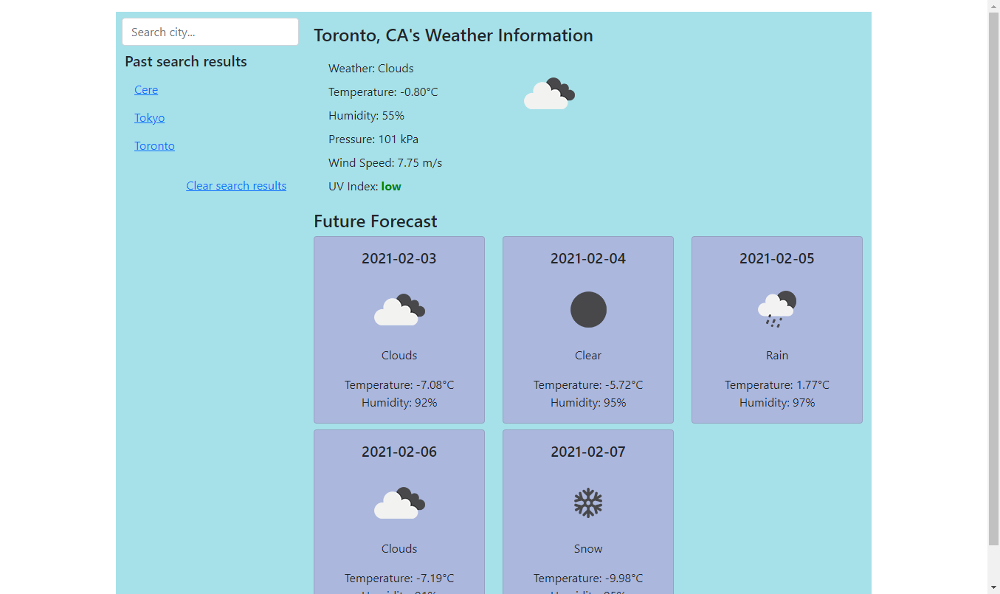

# 06 Server-Side APIs: Weather Dashboard

Takes advantage of the [OpenWeather API](https://openweathermap.org/api) to retrieve and display
weather data for cities across the world. Will also save search history for ease of use.

## Link to Live Website

https://sinsinkun.github.io/UTOR-WeatherApp

## Screenshot

